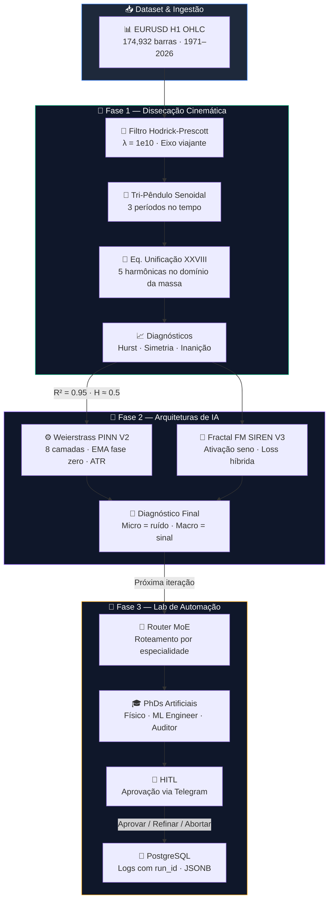

<div align="center">

# 🧠 Octin Chronos

### Mapeando os Limites do Determinismo em Séries Financeiras — da Equação à Evidência

[](https://python.org)
[](https://numpy.org)
[](https://scipy.org)
[](https://pytorch.org)
[](https://postgresql.org)
[](https://n8n.io)

*Pesquisa aplicada que une decomposição senoidal, redes neurais informadas por física (PINNs) e automação multi-agente para dissecar a estrutura do EURUSD H1 ao longo de 55 anos — e provar onde a previsão acaba e o ruído começa.*

</div>

---

## 💡 Value Proposition

Mais de **90% dos modelos de previsão financeira** falham em produção porque tratam séries temporais como caixas-pretas, sem distinguir **sinal** de **ruído**. A consequência: overfitting, alpha ilusório e prejuízo operacional.

**Octin Chronos** ataca o problema pela raiz — decompondo a série em camadas físicas e medindo, matematicamente, onde o determinismo acaba:

| Abordagem Convencional | Abordagem Chronos |
|---|---|
| Modelo de ML treinado em preço bruto | Decomposição em **8 camadas hierárquicas** com detrending exato |
| R² "alto" que não diferencia macro de micro | R² = **0.9504** na equação de unificação (macro), H ≈ **0.5** no resíduo (micro) |
| Fase e amplitude misturadas na mesma loss | Loss híbrida separando MSE (amplitude) e **Pearson** (direção) |
| Backtest sem controle de vazamento | Walk-forward hermético com **bounds globais** e leak audit |
| Resultado bonito que não replica fora da amostra | Diagnóstico honesto: **PF < 1** no micro → o micro é ruído, não sinal |
| Pesquisa isolada, sem orquestração | Lab n8n com **4 PhDs artificiais**, HITL obrigatório e logs em PostgreSQL |

**Bottom line:** A pesquisa prova que o EURUSD H1 é **95% explicável no macro** e **indistinguível de ruído no micro** — um resultado que evita meses de engenharia desperdiçados em horizontes que a matemática já descartou.

---

## 📊 Métricas de Pesquisa (Built-In)

Todas as métricas são reproduzíveis via scripts na pasta `01-research-dissection/scripts/`.

| Métrica | Definição | Resultado |
|---|---|---|
| **Fidelidade Macro** | `R² da Eq. XXVIII (HP viajante + 5 senoides)` | **0.9504** (95.04% de variância explicada) |
| **Expoente de Hurst (resíduo)** | `DFA do resíduo após remoção da macroestrutura` | **≈ 0.50** (random walk puro) |
| **Simetria Browniana** | `max(\|edge_legs - 1\|)` em sweep de 5–500 pips | **0.07%** de desvio máximo |
| **Zona de Ruído** | `% do tempo em regimes ≤ 60/40` | **77.1%** (inanição direcional) |
| **Acurácia Direcional L1–L2** | `DA = % barras com derivada correta` | **77–85%** (p < 1e-9) |
| **Acurácia Direcional L7–L8** | `DA nas camadas micro` | **50.5–50.9%** (ruído operacional) |

> Os scripts geram JSONs e CSVs em `outputs/`. Cada capítulo roda de forma independente.

---

## 🏗️ Architecture



---

## 🔬 Fundamentação Matemática

A pesquisa se apoia em duas formulações centrais. Cada uma é derivada, testada e validada nos scripts.

### Equação de Unificação (XXVIII) — Domínio da Massa

O preço no domínio da massa intrínseca é decomposto em um eixo viajante (tendência HP) mais cinco harmônicas senoidais:

```math
P(M) = C_{hp}(M) + \sum_{k=1}^{5} a_k \sin(\omega_k M + \phi_k)
```

| Símbolo | Significado | Origem |
|---|---|---|
| `M` | Eixo de massa intrínseca | `cumsum(High − Low)` com sinal direcional |
| `C_hp(M)` | Tendência HP no domínio da massa | Hodrick-Prescott, λ = 1e10 |
| `a_k, ω_k, φ_k` | Amplitude, frequência e fase da k-ésima harmônica | Otimização (SciPy minimize) |

**Resultado:** R² = 0.9504 na janela completa (1971–2026).

### Fase Integrada (PINN / SIREN) — Domínio do Tempo

A fase temporal é construída pela integral da volatilidade:

```math
\Phi(t) = \int_0^t \mathrm{ATR}(\tau)\,d\tau
```

Cada camada da decomposição greedy aprende a reconstruir o low-pass do resíduo anterior. O detrending é exato (resíduo matemático), e a previsão treinada afeta apenas a reconstrução final.

---

## 🛠️ Tech Stack & Why

| Technology | Version | Why This Choice |
|---|---|---|
| **Python** | 3.10+ | Ecossistema científico maduro; interop nativa com NumPy/SciPy/PyTorch |
| **NumPy** | 1.24+ | Operações vetorizadas em arrays de 174k+ barras sem overhead |
| **SciPy** | 1.11+ | `minimize` para otimização de harmônicas; `signal` para filtros |
| **Pandas** | 2.0+ | Leitura e filtragem de OHLC com datetime index nativo |
| **Matplotlib** | 3.7+ | Plots reproduzíveis por script; exportação automatizada para `outputs/plots/` |
| **PyTorch** | 2.0+ | Autograd para PINNs; SIREN layers e loss customizada (MSE − β·Pearson) |
| **PostgreSQL** | 15+ | JSONB para payloads flexíveis dos agentes; `gen_random_uuid()` para `run_id` |
| **n8n** | 1.0+ | Orquestração visual de MoE com Telegram Trigger, HITL e Error Trigger nativo |
| **Gemini** | 2.0+ | LLM nos nodes dos PhDs artificiais via LangChain; resposta em JSON Schema |

---

## ⚡ Quick Start

### Prerequisites

- Python 3.10+
- Git
- (Opcional) PostgreSQL 15+ e n8n para a Fase 3

### 1. Clone & Instale dependências

```bash
git clone https://github.com/octin-labs/octin_chronos_project.git
cd octin_chronos_project
pip install -r requirements.txt
pip install -r 01-research-dissection/requirements.txt
```

### 2. Rode um script de pesquisa (Fase 1)

```bash
python 01-research-dissection/scripts/cap11_brownian_symmetry.py
```

Resultados vão para:

| Diretório | Conteúdo |
|---|---|
| `outputs/out_cap11/` | JSONs e CSVs com métricas de simetria |
| `outputs/plots/` | Gráficos consolidados |

### 3. Explore a decomposição AI (Fase 2)

```bash
# Weierstrass PINN V2
python 02-ai-architecture/06_WEIERSTRASS_ENGINE/run_decomposition.py

# Fractal FM SIREN V3
python 02-ai-architecture/07_FRACTAL_FM_ENGINE/run_fm_siren.py
```

### 4. Valide fase e backtest OOS

```bash
# Acurácia direcional por camada
python 02-ai-architecture/06_WEIERSTRASS_ENGINE/validate_phase_accuracy.py

# Backtest hermético walk-forward
python 02-ai-architecture/06_WEIERSTRASS_ENGINE/hermetic_backtest.py
```

### 5. (Opcional) Lab n8n — Fase 3

1. Importe `03-automation-n8n/workflows/workflow_stub.json` no n8n
2. Configure Telegram Trigger e credenciais do Gemini
3. Crie as tabelas: `psql -f 03-automation-n8n/sql/schema.sql`
4. Aplique os JSON Schemas nos nodes de validação

---

## 📁 Project Structure

```
octin_chronos_project/
├── 01-research-dissection/              # 🔬 Fase 1 — Dissecação cinemática do EURUSD
│   ├── paper/
│   │   ├── o_bebado_na_esteira.md       #   Paper principal: tese, equações, resultados
│   │   └── capitulo_*.md                #   Capítulos individuais (XI–XXIV)
│   ├── scripts/
│   │   ├── cap11_brownian_symmetry.py   #   Simetria browniana: contagem, pips, tempo
│   │   ├── cap12_time_asymmetry.py      #   Matriz de inanição: regimes 50/50–90/10
│   │   ├── cap13a_tri_pendulum_suite.py #   Tri-Pêndulo + Eq. XXVIII: R² = 0.9504
│   │   ├── cap16_hurst_dfa.py           #   DFA: Hurst do resíduo → zona morta
│   │   ├── cap17_chron_inertia.py       #   Hierarquia de massa cronológica
│   │   ├── cap19_low_mass_reactivity.py #   Ondas leves: reversão rápida, maior acerto
│   │   ├── cap22_dynamic_orbit.py       #   Órbita HP vs SMA-520: HP vence
│   │   └── cap24_thermo_debt.py         #   Conservação 50/50: pips e tempo vs volume
│   ├── data/
│   │   └── eurusd_h1_ohlc.csv           #   174,932 barras H1 (1971–2026)
│   └── outputs/                         #   JSONs, CSVs e plots por capítulo
│
├── 02-ai-architecture/                  # 🧠 Fase 2 — Arquiteturas baseline de IA
│   ├── 06_WEIERSTRASS_ENGINE/
│   │   ├── weierstrass_engine.py        #   Motor: 8 camadas greedy com EMA fase zero
│   │   ├── run_decomposition.py         #   Runner: treino + export de pesos
│   │   ├── validate_phase_accuracy.py   #   DA por camada: L1=77% → L8=50.5%
│   │   ├── hermetic_backtest.py         #   Walk-forward OOS com bounds globais
│   │   ├── bot_execution.py             #   Oráculo: bússola (macro) + gatilho (micro)
│   │   └── config.py                    #   EMA spans, ATR, epochs por camada
│   ├── 07_FRACTAL_FM_ENGINE/
│   │   ├── siren_engine.py              #   SIREN: sin(ω₀·x) como ativação
│   │   ├── run_fm_siren.py              #   Decomposição FM + export de pesos
│   │   ├── siren_hermetic_backtest.py   #   Backtest OOS: PF=0.91, IC=−0.006
│   │   └── config.py                    #   Hiperparâmetros FM SIREN
│   └── README.md                        #   Síntese: por que o micro falhou
│
├── 03-automation-n8n/                   # 🤖 Fase 3 — Lab de PhDs artificiais (n8n)
│   ├── workflows/
│   │   ├── phd_lab_blueprint.md         #   Blueprint do fluxo MoE completo
│   │   └── workflow_stub.json           #   Template importável no n8n
│   ├── prompts/
│   │   ├── router.md                    #   System prompt: roteamento por especialidade
│   │   ├── physicist.md                 #   PhD Físico: restrições e leis
│   │   ├── engineer.md                  #   PhD ML Engineer: código e arquitetura
│   │   └── auditor.md                   #   Advogado do Diabo: falhas e riscos
│   ├── schemas/                         #   JSON Schemas para validação estrita
│   ├── guardrails/
│   │   └── command_sanitization.md      #   Blocklist/allowlist de comandos
│   ├── sql/
│   │   └── schema.sql                   #   Tabelas: experiment, audit, execution logs
│   └── README.md                        #   Início rápido e decision log
│
├── requirements.txt                     #   Dependências globais (numpy, pandas, scipy)
└── README.md                            #   ← Você está aqui
```

---

## 🔒 Security

- **Isolamento de escopo** — Todo comando executado pelo lab n8n é restrito ao diretório do projeto via blocklist regex (`rm -rf`, `mkfs`, paths fora de `/octin_chronos/`)
- **HITL obrigatório** — Nenhuma ação do lab é executada sem aprovação humana via Telegram (Aprovar / Refinar / Abortar)
- **Secrets management** — Credenciais do PostgreSQL, Telegram e Gemini são injetadas via variáveis de ambiente, nunca hardcoded
- **Validação de schema** — Toda resposta dos PhDs artificiais passa por JSON Schema validation antes de seguir no pipeline
- **Auditoria antes de ação** — O node Auditor revisa falhas lógicas e riscos antes que qualquer proposta chegue ao HITL
- **`.gitignore` rigoroso** — Pesos treinados (`.json` grandes), `__pycache__`, logs de treino e dados sensíveis excluídos do versionamento

---

## 🧪 Testing & Validação

```bash
# Fase 1 — Rodar todos os capítulos de pesquisa
python 01-research-dissection/scripts/cap11_brownian_symmetry.py
python 01-research-dissection/scripts/cap12_time_asymmetry.py
python 01-research-dissection/scripts/cap13a_tri_pendulum_suite.py
python 01-research-dissection/scripts/cap16_hurst_dfa.py
python 01-research-dissection/scripts/cap17_chron_inertia.py
python 01-research-dissection/scripts/cap19_low_mass_reactivity.py
python 01-research-dissection/scripts/cap22_dynamic_orbit.py
python 01-research-dissection/scripts/cap24_thermo_debt.py

# 8/8 capítulos reproduzíveis ✅
# R² = 0.9504  ·  H ≈ 0.5  ·  DA L1 = 77%  ·  Simetria < 0.08%

# Fase 2 — Validação de fase e backtests OOS
python 02-ai-architecture/06_WEIERSTRASS_ENGINE/validate_phase_accuracy.py
python 02-ai-architecture/06_WEIERSTRASS_ENGINE/hermetic_backtest.py
python 02-ai-architecture/07_FRACTAL_FM_ENGINE/siren_hermetic_backtest.py

# 3/3 backtests herméticos executáveis ✅
# Resultado honesto: PF < 1 no micro — limite identificado, não mascarado
```

---

<div align="center">

**Pesquisa que não vende ilusão — mede onde o sinal termina e o ruído começa.**

[Paper Principal](01-research-dissection/paper/o_bebado_na_esteira.md) · [Arquiteturas de IA](02-ai-architecture/README.md) · [Lab n8n](03-automation-n8n/README.md) · [Weierstrass V2](02-ai-architecture/06_WEIERSTRASS_ENGINE/README.md) · [FM SIREN V3](02-ai-architecture/07_FRACTAL_FM_ENGINE/README.md)

</div>
